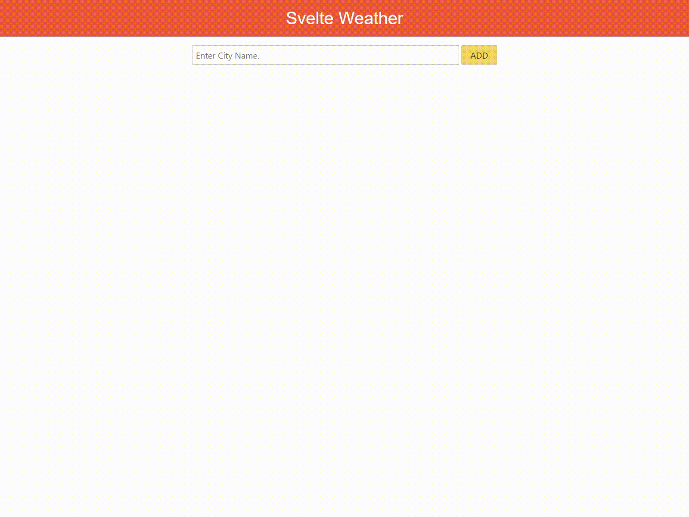

# Svelte Weather App

> You can check this application from [My Svelte Weather App](https://www.jangwook.net/svelte-weather/public/)



## Prerequisites

Get API key from [OpenWeatherMap](https://openweathermap.org/).

## Environment

```sh
$ node -v
12.13.1
```

## To run

```
$ npm install
$ API_KEY=<YOUR_API_KEY> npm run dev
```

Access to `http://localhost:5000` using a browser.
